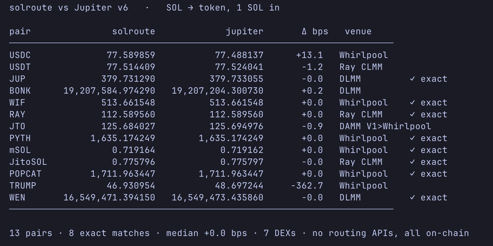
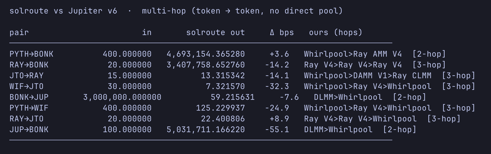

# solroute

A Rust DEX **routing + execution** engine for Solana. Loads pools across 7 DEX
protocols **plus the pump.fun bonding curve** (pre-graduation), finds optimal
multi-hop swap routes with live on-chain pricing, and builds/simulates/lands the
resulting swaps as versioned transactions — all without external routing or
price APIs.

Every quote is computed from raw on-chain account bytes using each protocol's
own swap math. No third-party quote API, no price oracle.

## Benchmarks vs Jupiter

All numbers below come from `scripts/jup_compare.py` and `scripts/jup_multihop.py`,
which quote the same pairs on solroute and on Jupiter v6 and diff the output in
basis points. solroute uses **only on-chain state** — no routing API.

### Single-hop — SOL → token, 1 SOL in



**13 pairs · 8 exact matches (to the unit) · median +0.0 bps · 7 DEXs · no routing APIs, all on-chain.**

solroute picks the same venue and reproduces Jupiter's quote to the last unit on
JUP, WIF, RAY, PYTH, mSOL, JitoSOL, POPCAT and WEN — because both run the same
underlying DEX math on the same pool state. Where it wins/loses (USDC +13.1 bps,
TRUMP −362.7 bps) the gap is venue coverage, not math error.

### Multi-hop — token → token, no direct pool



Every row is a **2–3 hop route composed across different protocols** in a single
swap (e.g. `Whirlpool > DAMM V1 > Raydium CLMM` — three protocols, one route),
all landing within **±55 bps** of Jupiter with no direct pool for the pair.

### pump.fun bonding curve (pre-graduation)

Beyond the 7 AMM/CLMM venues, solroute quotes and executes on the **pump.fun
bonding curve** — pre-graduation tokens trading against virtual reserves on
program `6EF8…F6P`, before they migrate to PumpSwap. Verified live on mainnet:

- **Quoting matches Jupiter to the unit (+0.0 bps)** across live curves — same
  virtual-reserve constant product and 95 + 30 bps (protocol + creator) fee.
- **Buy `simulateTransaction` PASS** on live curves (~95k CU) — real program
  acceptance of the full account layout, PDAs (`bonding_curve`,
  `creator_vault`, `bonding_curve_v2`, volume accumulators) and args.

Reproduce: `RPC_URL=… cargo run -p solroute-aggregator --bin bc_probe -- <mint>`
(quote) and `--bin bc_sim -- <mint> <funded_payer>` (simulate a buy).

### On-chain simulation

Quotes are one thing; **execution correctness** is another. `scripts/sim_verify.py`
builds the actual swap transaction for each route and runs it through
`simulateTransaction` against live mainnet state (no SOL, no signature). Current
result: **10/13 routes PASS live simulation** — real program acceptance, correct
account layouts, PDAs, and remaining accounts. The 3 residual failures are
per-venue execution edge cases (Whirlpool tick-array coverage on large swaps,
DAMM V1 depeg remaining-accounts, one stale hot-vault), not quoting errors.

## Features

- **Routing (7 DEXs)** — Raydium AMM V4, Raydium CLMM, Meteora DAMM V1/V2,
  Meteora DLMM, Pumpfun AMM (PumpSwap), Orca Whirlpools. 3.3M+ pools loadable.
- **Exact per-venue math** — each venue quotes with its protocol's own swap
  algorithm ported/depended-on from the source program or SDK: DLMM bin
  traversal, CLMM/Whirlpool tick traversal, DAMM stableswap `D`/`y` (Newton, with
  LST depeg virtual price), constant-product. Not approximations.
- **Multi-hop routing** (1–4 hops) with hub-based + bidirectional neighbor
  search, a **canonical-edge cache** (deepest-liquidity pool per pair for
  intermediate hops), and a **reverse-reachability prune** for 3/4-hop search.
- **Data-driven hubs** — top-K mints by pool degree, unioned with settlement
  seeds (WSOL/USDC/USDT).
- **Execution (all 7 DEXs)** — builds swap instructions from parsed pool state
  (including tick-array / bin-array / dynamic-vault / oracle accounts), resolves
  the real token program (SPL Token / Token-2022), signs, and submits.
- **v0 transactions + Address Lookup Tables** — multi-hop routes that exceed the
  1232-byte legacy limit are compressed via an ALT (on-the-fly creation or a
  pre-warmed table) and landed as v0 transactions.
- **Transaction simulation** — validate any route against live state with zero
  SOL and no signature (`sigVerify=false` + `replaceRecentBlockhash=true`).
- **On-chain SOL/USD pricing** from Raydium CLMM `sqrt_price_x64` — no oracles.
- **Real-time streaming** via Yellowstone gRPC (Geyser): shaped account
  subscriptions, slot-guarded writes, from-slot resume, idle watchdog.
- **Instant startup** from a binary pool cache (~6s vs ~4min from RPC).
- **Pure DEX crates** — no I/O, no async, just math. Each implements the
  `Market` trait independently.

## Coverage: routing vs execution

| DEX | Routing | Execution | Quote math |
|---|:---:|:---:|---|
| Raydium AMM V4 | ✅ | ✅ | constant product |
| Raydium CLMM | ✅ | ✅ | ported tick traversal (Raydium program) |
| Meteora DAMM V1 | ✅ | ✅ | vault-share + stableswap `D`/`y` + depeg |
| Meteora DAMM V2 | ✅ | ✅ | cp-amm |
| Meteora DLMM | ✅ | ✅ | ported bin traversal (Meteora dlmm-sdk) |
| Pumpfun AMM (PumpSwap) | ✅ | ✅ | bonding-curve AMM |
| Orca Whirlpools | ✅ | ✅ | official `orca_whirlpools_core` |
| pump.fun bonding curve (pre-bond) | ✅ | ✅ | virtual-reserve CP + 95/30 fee (=Jupiter +0.0 bps) |

Concentrated/bin/vault swaps (CLMM/Whirlpool tick arrays, DLMM bin arrays, DAMM
V1 dynamic vaults) build their variable account sets from pool state; CLMM/DLMM
use `None` bitmap-extension data (near-price swaps, ±512 tick arrays / active bin
± 1) — very large swaps crossing many arrays would need the extension account.

## Quick Start

### Run the Engine (HTTP API)

Persistent service that keeps all pool data in memory and serves quotes.

```bash
RPC_URL="https://your-rpc-endpoint.com" cargo run --release --bin solroute-engine

# In another terminal:
curl "http://localhost:8080/health"
curl "http://localhost:8080/price?mint=SOL"
curl "http://localhost:8080/quote?inputMint=SOL&outputMint=<mint>&amount=100000000&maxHops=2"
```

### Aggregator CLI

```bash
cargo build --release -p solroute-aggregator
RPC_URL="https://your-rpc-endpoint.com" ./target/release/solroute-cli
```

### Reproduce the benchmarks

```bash
# Quote SOL -> token on solroute + Jupiter v6, diff in bps (single-hop table)
python3 scripts/jup_compare.py

# Token -> token with no direct pool (multi-hop table)
python3 scripts/jup_multihop.py

# Build each route's tx and simulate it against live state (PASS/FAIL)
python3 scripts/sim_verify.py
```

### Testing tools (no engine required)

```bash
# Build a bounded sample cache from a handful of pools (needs RPC once)
RPC_URL=... cargo run --release -p solroute-aggregator --bin sample-cache -- <addrs.json> pools.cache

# Time find_routes over the cache — pure in-memory, zero RPC
cargo run --release -p solroute-aggregator --bin bench -- pools.cache 2000

# Simulate route execution against live state — no SOL, no signature
RPC_URL=... cargo run --release -p solroute-aggregator --bin simulate -- pools.cache [payer_pubkey]

# Land a real single-hop swap via v0 + ALT (spends SOL — burner wallet only)
RPC_URL=... SIGNER_KEY=<base58 secret> cargo run --release -p solroute-aggregator --bin land -- pools.cache

# Build + land a real multi-hop, multi-protocol route via v0 + ALT
RPC_URL=... SIGNER_KEY=<base58 secret> cargo run --release -p solroute-aggregator --bin multihop -- pools.cache
```

## Architecture

```
solroute-core              Market trait, shared types, constants, AccountDataProvider
    ^
    +-- raydium-amm-v4    Constant product AMM
    +-- raydium-clmm      Concentrated liquidity (ported tick traversal)
    +-- meteora-damm      Dynamic AMM V1 + V2 (stableswap + depeg)
    +-- meteora-dlmm      Dynamic liquidity bins (ported bin traversal)
    +-- pumpfun-amm       Bonding curve / AMM
    +-- orca-whirlpool    Whirlpool (official orca_whirlpools_core math)

solroute-aggregator        Pool loading, routing, pricing, caching, CLI,
                          route->executor bridge (execute.rs)
solroute-executor          Swap instruction builders, ATA/wrap helpers, ALT,
                          v0 tx assembly + simulate + submit
solroute-engine            Persistent service: AccountStore + gRPC streaming + HTTP API
solroute            Root crate: re-exports all DEX crates; solroute-engine bin
```

### Routing flow

```
GET /quote -> Router.find_routes
   1-hop direct + 2-hop (hubs + neighbor fwd/rev)
   + 3-hop (hub-hub, neighbor-hub, reverse-reachability pruned)
   + 4-hop (neighbor -> hub -> neighbor)
   intermediate legs use the canonical-edge cache; the FINAL leg full-scans
   every pool on the pair (deepest liquidity != best price for a given size)
   -> routes ranked by output amount
```

### Execution flow

```
Route -> execute::build_hop_instructions        (per hop)
   look up pool in PoolIndex, decode CachedPool, dispatch on venue
   resolve real token program (SPL Token / Token-2022) per mint
   -> executor::{raydium_amm_v4,raydium_clmm,meteora_*,pumpswap,orca_whirlpool}::build_swap
      (+ ATA create / WSOL wrap / close as needed)

execute::execute_route
   compute-budget ixs + per-hop slippage floor
   -> fits under 1232 bytes?  v0 tx, no ALT
      else pre-warmed ALT supplied?  use it
      else create + extend an ALT on-chain (finalized slot, wait a slot)
   -> sign v0 tx -> send (preflight-protected)
```

### Engine startup

```
1. Load cache              ~6s      pools.cache -> PoolIndex
2. validate_from_cache     instant  cached vault balances -> swappable set
3. warm canonical + hubs   ~ms      router structures ready
4. Start HTTP server       instant  /quote works immediately
5. gRPC streaming          bg       live account updates + vault re-validation
6. Vault fetch             bg       4M+ accounts, 100 concurrent batches
7. SOL/USD price refresh   bg       every 15s
```

### Project Structure

```
solroute/
├── bin/engine.rs                     Engine binary entry point
├── crates/
│   ├── core/                         Market trait, AccountDataProvider, constants
│   ├── raydium-amm-v4/               RaydiumAMMV4 + market
│   ├── raydium-clmm/                 CLMM pool + market + tick arrays + exact quote
│   ├── meteora-damm/                 DAMM V1 + V2 markets + models + exact quote
│   ├── meteora-dlmm/                 DLMM pool + market + bin-traversal quote
│   ├── pumpfun-amm/                  Pumpfun AMM pool + market
│   ├── orca-whirlpool/               Whirlpool pool + market (orca_whirlpools_core)
│   ├── aggregator/                   Loading, routing, pricing, caching, CLI, execute bridge
│   │   └── src/
│   │       ├── loader.rs             RPC pool loading (getProgramAccountsV2 paginated)
│   │       ├── cache.rs              Disk cache + PDA extraction
│   │       ├── router.rs             Multi-hop routing (canonical cache, hubs, prune)
│   │       ├── pool_index.rs         Token-pair graph + canonical-edge + hub ranking
│   │       ├── price.rs              On-chain pricing (CLMM sqrt_price)
│   │       ├── execute.rs            Route -> executor bridge (build / simulate / land)
│   │       ├── stats.rs              Routing quality / scoreboard stats
│   │       ├── cli.rs                Progress bars + REPL
│   │       └── bin/                  sample_cache, bench, simulate, land, multihop, sim_route, sim_pool
│   ├── engine/                       Persistent service (library)
│   │   └── src/
│   │       ├── account_store.rs      DashMap store, implements AccountDataProvider
│   │       ├── pool_registry.rs      Swappable validation, vault->pool index
│   │       ├── cold_start.rs         Background vault/tick/bin-array fetch + hot-vault refresh
│   │       ├── streaming.rs          Yellowstone gRPC live updates (shaped subs)
│   │       └── api.rs                Axum HTTP: /quote, /price, /health
│   └── executor/                     Swap execution
│       └── src/
│           ├── raydium_amm_v4.rs     swap_base_in (fetches Serum market from RPC)
│           ├── raydium_clmm.rs        swap_v2 + tick-array remaining accounts
│           ├── meteora_damm_v1.rs     vault-based swap (15 accounts)
│           ├── meteora_damm_v2.rs     swap2 builder (14-account layout)
│           ├── meteora_dlmm.rs        swap + bin-array remaining accounts
│           ├── pumpswap.rs           Pump AMM buy/sell (full account fidelity)
│           ├── orca_whirlpool.rs      classic swap (oracle + current±2 tick arrays)
│           ├── ata.rs                ATA create / WSOL wrap / close
│           ├── alt.rs                Address Lookup Table create/extend/fetch
│           ├── submit.rs             Compute budget, v0 tx, sign, simulate, send
│           └── types.rs             SwapLeg, SwapOptions
├── scripts/                          jup_compare / jup_multihop / sim_verify (benchmarks)
└── tests/                            Live gRPC/RPC integration tests
```

## Configuration

| Variable | Default | Description |
|---|---|---|
| `RPC_URL` | `https://api.mainnet-beta.solana.com` | Solana RPC endpoint |
| `CACHE_PATH` | `pools.cache` | Pool cache file location |
| `CACHE_MAX_AGE` | `3600` | Max cache age (seconds) before RPC reload |
| `GEYSER_ENDPOINT` | (none) | Yellowstone gRPC endpoint for live streaming |
| `GEYSER_TOKEN` | (none) | Yellowstone gRPC auth token |
| `PORT` | `8080` | Engine HTTP API port |
| `SIGNER_KEY` | (none) | Base58 secret key for the `land` / `multihop` bins |

## Using the DEX crates as a library

The DEX crates are pure — no RPC, no async, no I/O:

```rust
use solroute_core::{Market, SwapDirection};

let pool: raydium_amm_v4::RaydiumAMMV4 = borsh::from_slice(&account_data)?;
let market = raydium_amm_v4::RaydiumAmmV4Market::new(pool, address, quote_bal, base_bal);

let price = market.current_price()?;
let output = market.calculate_output(1_000_000_000, SwapDirection::Buy)?;
```

Building a swap instruction from parsed pool state:

```rust
use solroute_executor::{meteora_damm_v2::{self, DammV2Accounts}, SwapLeg, SwapOptions};

let ixs = meteora_damm_v2::build_swap(&accounts, &leg, None, &SwapOptions::default())?;
```

## Development

```bash
cargo check                    # Type-check workspace
cargo build --workspace        # Build all crates + bins
cargo test --workspace --lib   # Unit tests (router + executor)

cargo build --release -p solroute-aggregator     # Aggregator CLI + tools
cargo build --release --bin solroute-engine       # Engine
```

## Notes & limitations

- **Single-path routing (no splits yet).** solroute picks one best path per hop;
  it does not yet split a single trade across multiple pools (the technique
  large aggregators use to cut slippage on big sizes). This is why very large
  swaps can lose bps to Jupiter even when the per-pool math is exact.
- **8 venues.** Missing e.g. Raydium CPMM, bonk.fun / Raydium LaunchLab, Meteora
  DBC, Lifinity, Phoenix, OpenBook — each new venue is a new `Market` crate.
- **pump.fun BC ingestion is mint-driven.** The BondingCurve account carries no
  base mint and its PDA can't be reversed, so curves can't be enumerated via
  `getProgramAccounts` (also blocked on stock RPCs). solroute resolves curves
  from a supplied mint list (`load_bonding_curves_for_mints`); production
  auto-discovery of new launches is via pump `create`/trade event streaming
  (not yet wired). Native-SOL curves only; USDC-quoted (V2) curves are skipped.
- **Multi-hop amount chaining** uses the router's quoted per-hop amounts with a
  safety haircut on intermediate inputs (a hop can only spend what the previous
  hop actually produced on-chain); a production version would quote the whole
  route atomically.
- **No SWQoS/Jito fan-out** — swaps submit via plain RPC (preflight-protected).
  Callers wanting MEV lanes can serialize the signed tx and forward it.
- Execution builders are ported from FnZero `sol-trade-sdk` (MIT), adapted to
  feed from solroute's own pool structs.

## References

- [Raydium AMM](https://github.com/raydium-io/raydium-amm)
- [Raydium CLMM](https://github.com/raydium-io/raydium-clmm)
- [Meteora DAMM V1](https://github.com/MeteoraAg/damm-v1-sdk)
- [Meteora DAMM V2](https://github.com/MeteoraAg/damm-v2)
- [Meteora DLMM](https://github.com/MeteoraAg/dlmm-sdk)
- [Orca Whirlpools](https://github.com/orca-so/whirlpools)
- [Pumpfun AMM](https://solscan.io/account/pAMMBay6oceH9fJKBRHGP5D4bD4sWpmSwMn52FMfXEA)
- [pump.fun program / IDL](https://github.com/pump-fun/pump-public-docs) (bonding curve `6EF8…F6P`)
- [FnZero sol-trade-sdk](https://github.com/0xfnzero/sol-trade-sdk) — reference for pump.fun BC + other pre-bond math/instructions

## License

MIT
